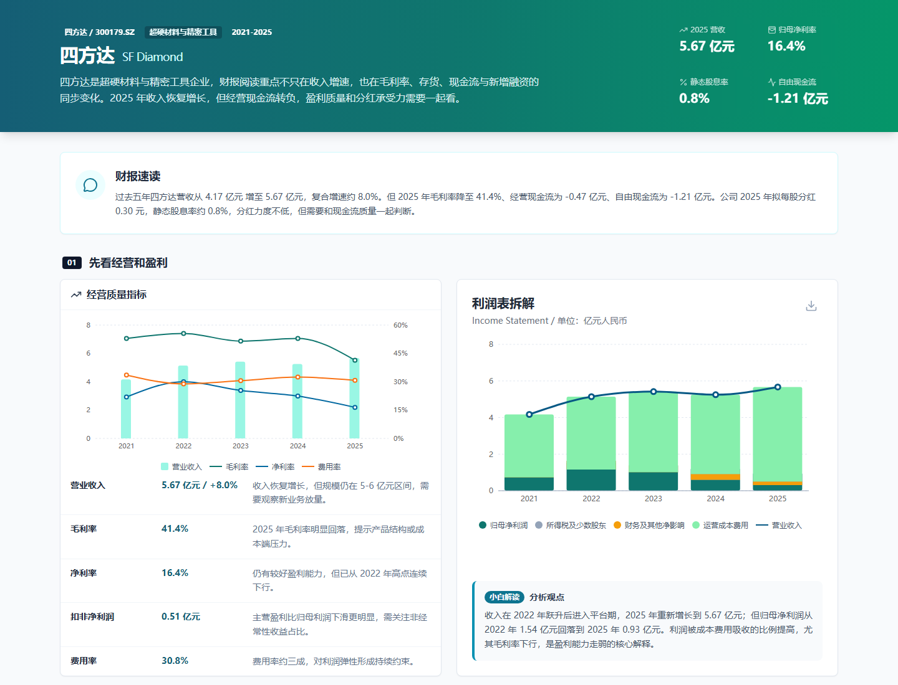
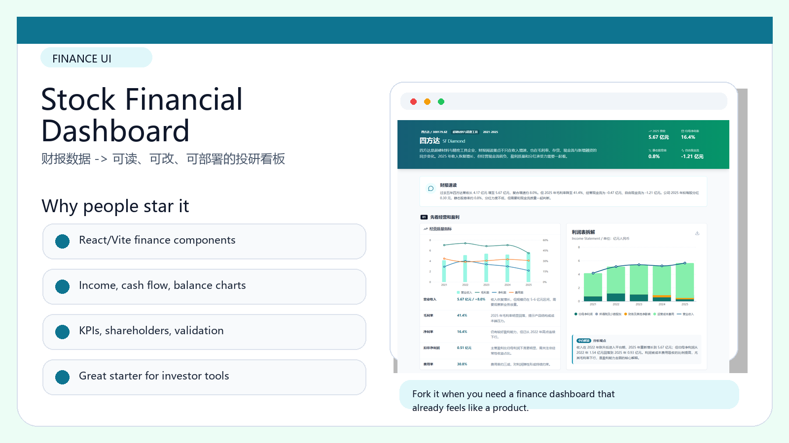
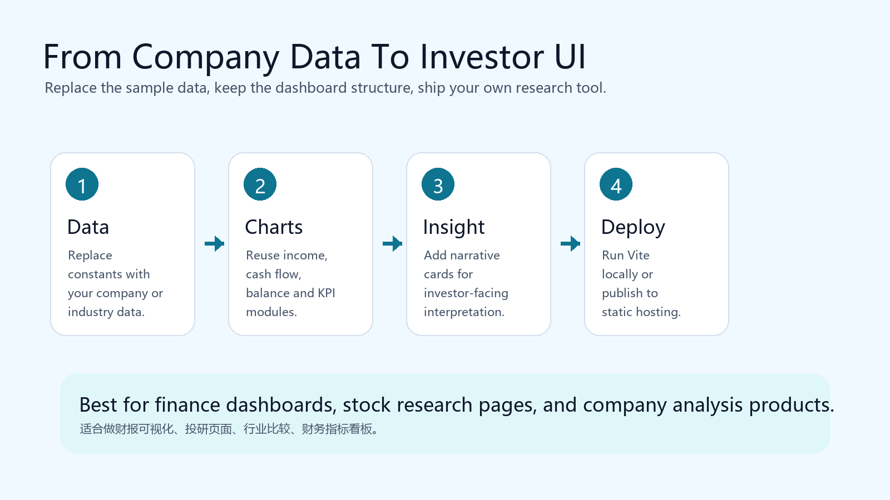

# OpenClaw Stock Financial Dashboard | 股票财报可视化仪表盘

Turn financial statements into a product-grade dashboard: charts, metrics, investor signals, and a clean React/Vite interface that is easy to study, remix, and deploy.

把财报数据变成真正能看的产品界面：收入、利润、现金流、资产负债、股东回报、市场共识与关键指标集中在一个可复用的 React/Vite 仪表盘里。




## Visual Tour | 图像导览

| Product Highlights | Build / Remix Flow |
|---|---|
|  |  |

## Why Star This | 为什么值得 Star

- Built for people who want to learn how financial data becomes readable UI, not just another chart demo.
- Includes reusable chart components, metric constants, validation scripts, and two cleaned dashboard baselines.
- Works as a starter for company research pages, investor memo tools, industry comparison views, and internal finance cockpits.
- 已清理真实部署信息和敏感凭证，适合公开学习、下载、二次开发。

## What Is Inside | 项目内容

- `apps/financial-report-visualizer`: React/Vite financial statement dashboard with chart components and validation scripts.
- `apps/investor-dashboard-template`: investor-facing finance dashboard baseline for company analysis pages.
- `docs/screenshot.png`: repository preview image for GitHub and social sharing.

## Best Use Cases | 适合做什么

- Listed-company financial statement visualization
- Investor research dashboards
- Business analysis templates
- Finance UI component study
- 财报可视化、投研页面、经营分析看板、财经产品原型

## Quick Start | 快速开始

```bash
cd apps/financial-report-visualizer
npm install
npm run dev
```

## Public Safety | 公开安全说明

Private deployment URLs, tokens, local state, and hosting identifiers were removed before publication.
