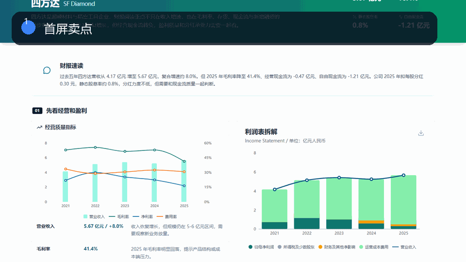
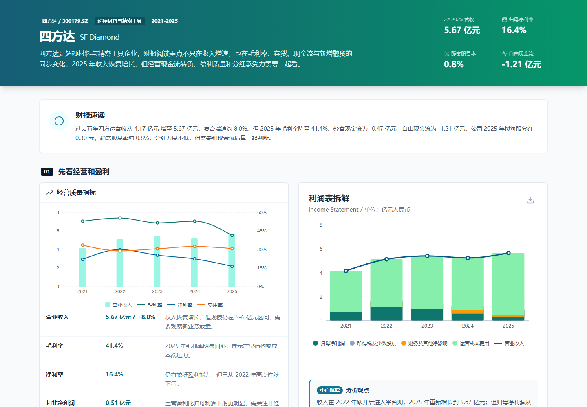
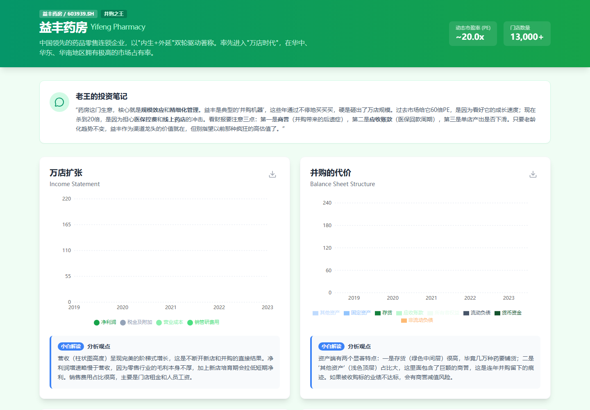
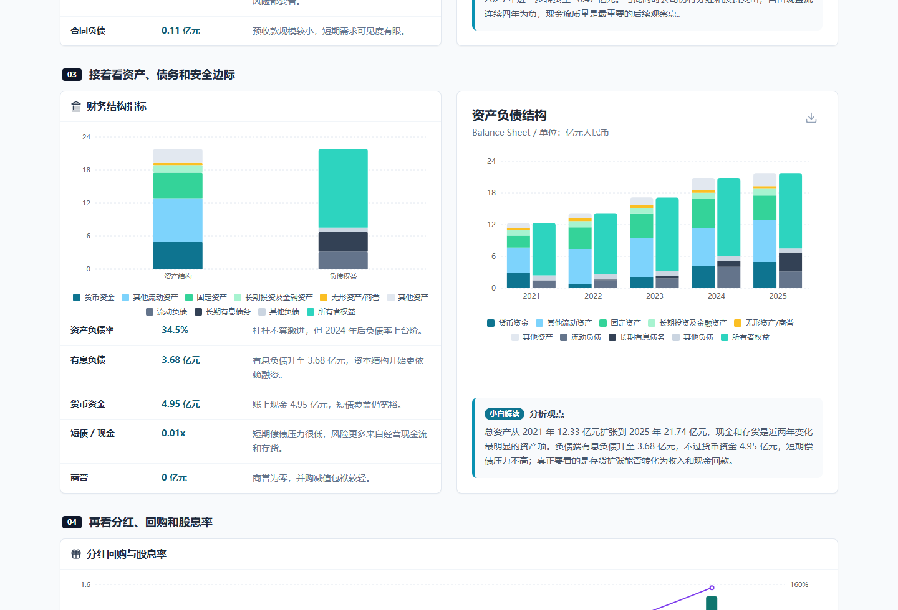
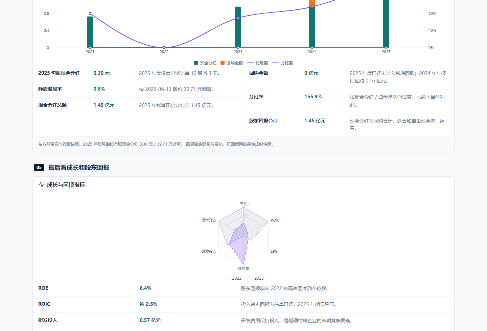

# OpenClaw 股票财报可视化仪表盘

一个面向投研、财务分析和公司研究场景的 React/Vite 财报看板，把利润表、现金流、资产负债、关键指标和投资叙事组织成可读的产品界面。

**English introduction:** [README_EN.md](README_EN.md)



## 一眼看懂

**把上市公司财报变成可直接 Fork 的投研看板**

- 适合做公司分析页、财经内容页、CFO 看板和投研 Memo。
- 利润表、现金流、资产负债、分红回购和指标解释已经整理成产品化界面。
- 替换数据后即可复用页面结构，不需要从 0 搭图表骨架。

## 30 秒改成你的项目

Fork 后进入 `apps/financial-report-visualizer`，替换财务指标常量和图表数据，就能生成自己的公司财报看板。

> 喜欢这种可直接改造的产品模板，欢迎 Star。它能帮你以后少搭一次骨架，多留一点时间打磨自己的数据和内容。

## 页面截图

下面四张图都来自本仓库真实中文页面渲染：首屏、滚动后的第二屏，以及两个关键功能视图。它们不是概念图，也不是英文占位图，能直接看到项目实际运行后的样子。

| 首屏截图 | 第二屏截图 |
|---|---|
|  |  |
|  |  |

## 系统功能总览

这个系统不是单纯画几张图，而是一套“上市公司财报 -> 投研阅读界面”的前端产品模板。它把高密度财务数据拆成多个可阅读模块，让用户可以从经营质量、盈利能力、现金流、资产负债、股东回报和市场观察几个角度快速理解一家公司。

## 核心功能

- **财报摘要首屏**：用公司名称、股票代码、核心标签、收入规模、毛利率、现金流等关键指标建立第一判断。
- **利润表可视化**：展示收入、毛利、费用、利润等数据变化，帮助判断增长质量和盈利结构。
- **现金流分析**：对经营现金流、投资现金流、筹资现金流和自由现金流做图表化展示。
- **资产负债结构**：用可视化模块观察资产、负债、现金、存货、应收账款等结构变化。
- **关键指标解释**：在图表旁提供“小白解读/分析观点”，让数据不只是数字，而能转成判断。
- **股东与市场视角**：保留投资者看板结构，可扩展为股东回报、估值指标、市场共识、公司研究页。
- **双项目结构**：包含财报图表应用和投资看板模板，适合分别学习组件化图表和产品化页面组织。
- **数据校验脚本**：包含用于检查财务数据一致性的脚本入口，方便继续扩展真实数据流程。

## 适合改造成什么

- 上市公司财报可视化页面
- 行业公司对比看板
- 投资研究 Memo 工具
- 经营分析或 CFO 内部看板
- 财经内容网站的单公司详情页

## 目录说明

- `apps/financial-report-visualizer`：React/Vite 财报图表应用，包含图表组件、指标常量和校验脚本。
- `apps/investor-dashboard-template`：投资者视角公司分析模板，适合改造成投研页面。
- `docs/`：项目截图和 README 展示图片。

## 快速开始

```bash
cd apps/financial-report-visualizer
npm install
npm run dev
```

## 公开安全说明

这个公开版本已经移除真实部署地址、生产密钥、Cloudflare token、本地环境文件、日志、`.wrangler`、`node_modules` 和任何不适合公开的私有信息。你可以放心把它当作学习、参考和二次开发的起点。

## 推荐 Star 的理由

如果你正在做类似产品，这个仓库不是只能看一眼的截图，而是能直接 Fork 的结构样板：页面、数据、组件、交互和说明文档都已经整理好，可以节省从 0 到 1 搭骨架的时间。
